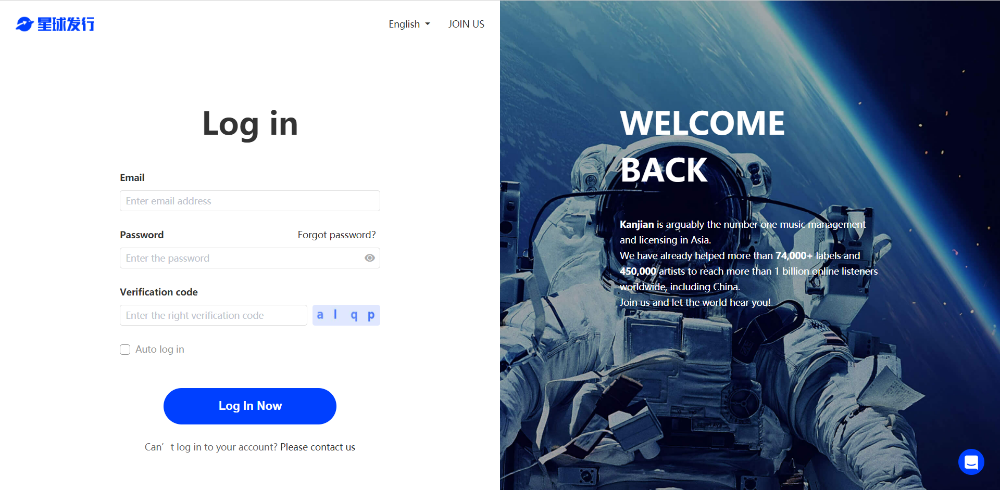

# Instructions for online licensing of works (mainland Chinese musicians)

The process is as follows:

### 1. Login / Register 【SDISTRO】

### 2. Upload album works

### 3. After uploading the album and submitting it, enter the signing process

### 4. Follow the prompts to sign online/do licensing

### 5. Complete the licensing and wait for the album to pass the audit before it can be distributed

