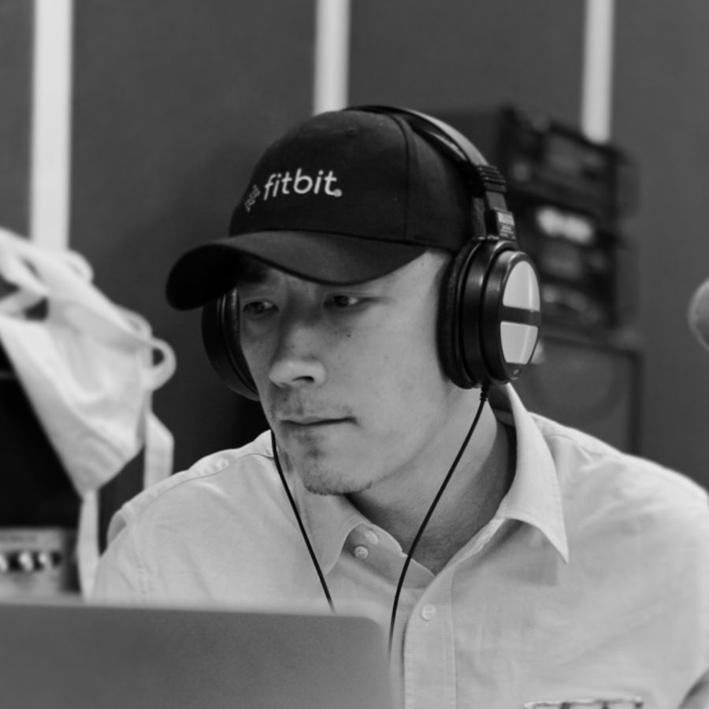

# 定制歌曲

库音支持用户自主提出音乐需求并针对需求进行音乐定制。定制起始价5000元，最终价格根据授权渠道、时间、区域、采买数量等因素而定。

如有需求，可填写下方表格，商务会在一个工作日内与您取得联系。[https://wj.qq.com/s2/9918155/7368/](https://wj.qq.com/s2/9918155/7368/)\

### 全球顶尖制作人（部分展示） 

| 制作人                                      | 简介                                                                                                                                                                                                                                                      |
| ---------------------------------------- | ------------------------------------------------------------------------------------------------------------------------------------------------------------------------------------------------------------------------------------------------------- |
| .png>)  | 
<strong>Lars Deutsch</strong> 德国

 两获艾美奖的全球顶级配乐制作人。他创作的电影音乐具有独特的魅力，同时也打造出了最前沿的品牌音乐。至今，已有超过 230 部获得百项大奖的电影音乐都出自 Lars 之手，除了电影电视剧的配乐外，他还作为多个品牌的音乐专家，为阿迪达斯、梅赛德斯一级方程式车队、大众集团、飞利浦等一系列国际知名品牌定制了独特的音乐商标。 
                                  |
|           | 
<strong>王辰</strong> <strong></strong>中国  音乐制作人、混音师、国家录音高级工程师。曾与朗朗、孙燕姿、 TF-Boys、王嘉尔、萧敬腾、张杰、谭晶等合作。部分代表作：谭晶专辑《看见》；TFBOYS《样》、《不完美小孩》；张杰《听!我们的歌》专辑《这就是爱》、《勿忘心安》、 《逆战》、《高飞》、《穿越人海》；任素汐《我要你》等。
                                                 |
| .png>)  | 
<strong>Huib Schouten</strong> 荷兰  有丰富的国际制作经验，曾与 Martin Garrix、Nicky Romero、Firebeatz、Rod Stewart、Brian Adams、Erasure 等合作。制作的歌曲在 Protocol, Ultra Music, Spinnin Records/Warner and Universal Music 等多个知名厂牌发布。 
                       |
| .png>) | 
<strong>向心·引力 studio</strong> 中国  青年作曲人，音乐制作人，主攻影视类、游戏类及其他歌曲和配乐制作 。曾参与《姜子牙》、《哪吒》、《一出好戏》、《港囧》、《美人鱼》、《同桌的你》等各大影视的音乐制作。
                                                                                                                    |
| .png>) | 
<strong>Sammy Merayah</strong>

比利时

 一位屡获殊荣的比利时制作人，曾与 Flo Rida、Timbaland、Missy Elliot、Chris Brown、Jason Derulo、Lil Jon、Katy B 等合作。
                                                                                                 |
| .png>)  | 
<strong>AT.yang</strong>

中国

知名唱作人，《中国新说唱》、《中国有嘻哈》、《热血街舞团》、《国风美少年》音乐制作组制作人。曾为吴亦凡《时间海》编曲、潘玮柏/邓紫棋/ICE《Climb To The Top》编曲、ICE/黄明昊 Justin/袁娅维《No Why》编曲等，代表作品有《NO EMOTION》、《MONEY》、《爱如潮水REMIX》、《快回家》、《当我开始说唱》等。
                   |
| .png>) | 
<strong>Christophe Rezai</strong>

法国/伊朗

著名电影、广告音乐制作人。曾与 Dariush Mehrjui, Mani Haghighi, Shahram Mokri, Safi Yazdanian, Rassoul Sadr Ameli 等导演合作。2003 年获得阿维尼翁电影节最佳电影音乐一等奖，2017 年凭借电影《Negar》获得第 35 届 Fajr 电影节的 Crystal Symorgh。
 |

