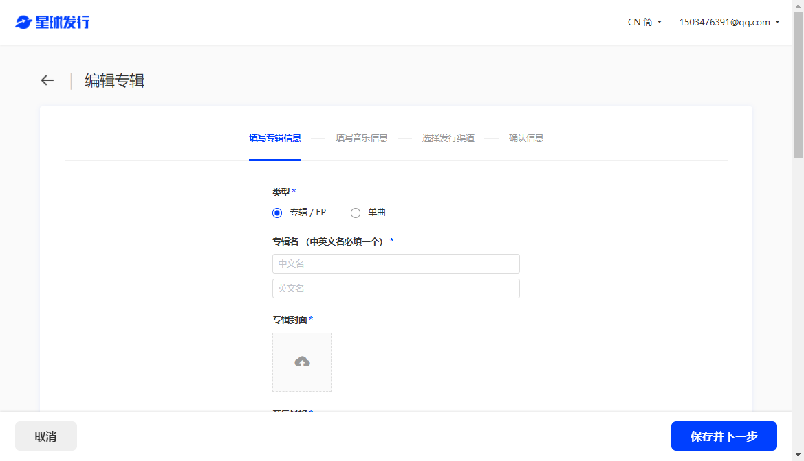
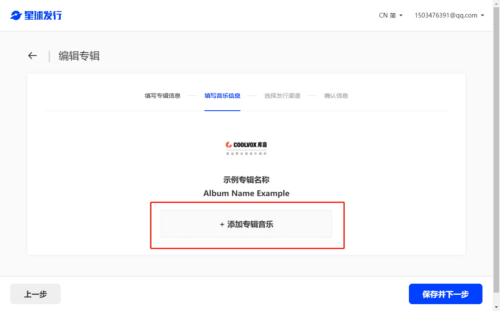
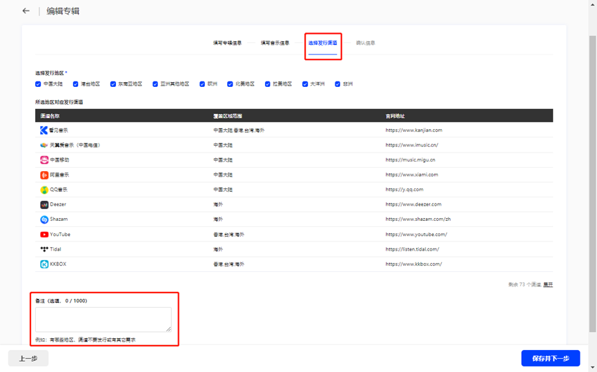
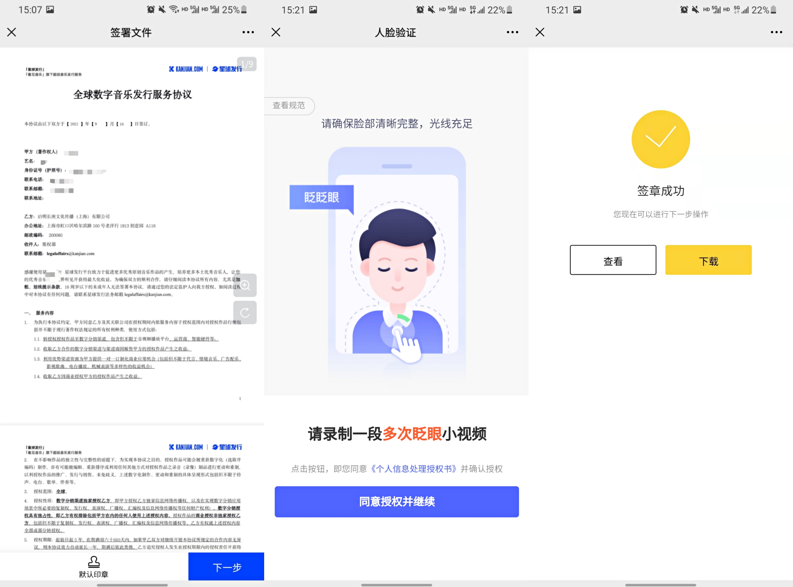

# 我要卖歌

## 批量授权 

如果你想将歌曲批量授权至库音，通过商用授权获取收益，请发送邮件至 [copyright@coolvox.com](mailto:copyright@coolvox.com?subject=\[%E5%95%86%E5%8A%A1%E5%90%88%E4%BD%9C]%20XXX%20%E5%85%AC%E5%8F%B8%E5%95%86%E5%8A%A1%E5%90%88%E4%BD%9C%E9%9C%80%E6%B1%82)，我们会在三个工作日内进行反馈。也可以快速扫码下方的企业微信与工作人员取得联系。

> 收件人：copyright@coolvox.com
>
> cc：chenchen.li@kanjian.com
>
> 主题：XXX 音乐人/厂牌合作需求


请在邮件主题标明**“音乐人/厂牌合作需求”**，方便我们快速对你的需求进行回复。


微信 / 企业微信：

.png>)

## 自主授权 

「库音 COOLVOX」支持用户自主上传音乐并进行商业授权。请登录「星球发行」，并根据提示进行上传。步骤如下：

1. 登录「星球发行」
2. 上传歌曲
3. 艺人审核
4. 授权「库音 COOLVOX」

### 登录「星球发行」

点击此处登录[「星球发行」](https://star.kanjian.com)平台。首次使用的客户，请先在注册账号后进行上传。

### 上传歌曲

上传专辑：将需要授权的作品以专辑为单位进行上传、填写歌曲信息，具体请根据页面指示进行操作。

.png>)

### 艺人审核

请扫描网页二维码，并在阅读《数字证书使用协议》后根据指示进行实名认证操作。

「星球发行」将严格遵循《中华人民共和国著作权法》。「星球发行」严禁任何包含违法犯罪、渲染暴力、色情淫秽、血腥重口的内容发布。

.png>)

### 授权「库音 COOLVOX」

扫描页面二维码，对「库音 COOLVOX」进行授权。

请仔细阅读合同内容，确认无误后，点击界面下方“默认印章”进行电子签名。随后点击“下一步”，进行最终的人脸验证。

如对合约有其他异议，可联系「星球发行」在线客服进行沟通。

&#x20;

授权成功后，作品会进入审核阶段，并在两周内上架至「库音 COOLVOX」。若有紧急需求，请通过电话021-6357 0107或在线客服与我们联系。

### 对于下列情况，歌曲不会通过审核：

1. 版权冲突
2. 含有敏感词（含有任何涉政信息、涉军信息、淫秽色情信息、涉黑暴力信息、涉毒涉赌信息及其他低俗、不良、有害信息等违法违规和违反公序良俗的内容)

##
